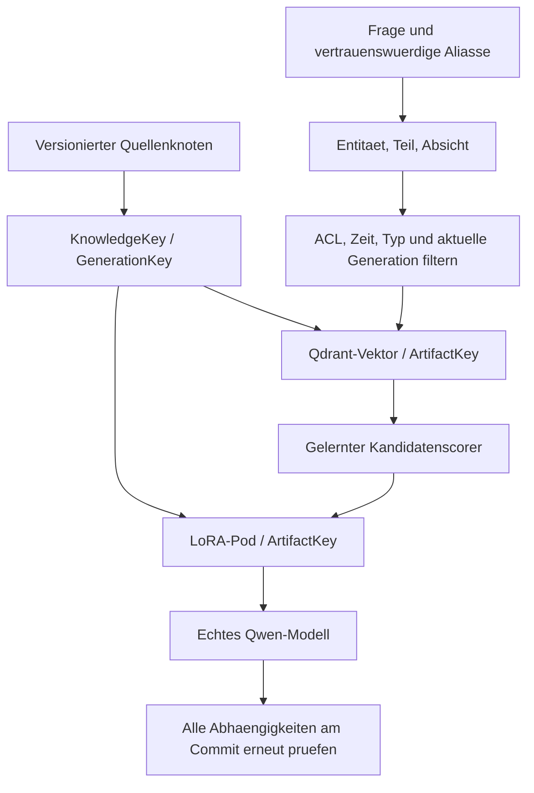

# Drei semantische Ebenen und vier Schluessel

Die Erweiterung liegt in `neural_pods/semantics.py` und `neural_pods/semantic_routing.py`.
Sie verwendet dieselbe persistente Herkunfts-Registry und dieselben echten Qwen-/PEFT-Modelle
wie der erste Pilot. Alte Pilotdateien bleiben lesbar; der neue Lauf verwendet eine eigene Registry.

## Vier Schluessel

| Schluessel | Bedeutung | Aenderung bei 24 -> 18 Tagen |
|---|---|---|
| OriginKey | Unveraenderlicher registrierter Quellenknoten mit Quellenidentitaet, Version, Inhalts-Hash und ACL | Neue Quellenversion erzeugt einen neuen Knoten |
| KnowledgeKey | Kanonische Adresse, z. B. `knowledge:supplier:muller:x12:lead_time` | Bleibt gleich |
| GenerationKey | Inhaltsadressierter Knoten einer konkreten Wissensgeneration | Wird ersetzt; alter Knoten bleibt historisch erhalten |
| ArtifactKey | Konkrete Ableitung: Adapter, Vektor, Text, Router, Cache oder Antwort | Neue Ableitung erhaelt einen neuen Schluessel |

Die Schluessel sind SHA256-basiert, ausser der expliziten semantischen Wissensadresse.
Sie sind keine Signaturen. Herkunftsknoten enthalten ihre registrierten Rechte; es gibt
hier keinen davon unabhaengigen globalen Quellen-ID-Dienst fuer mehrere Organisationen.



## Die Ebenen

**Retrieval:** vertrauenswuerdige Aliasse, Entitaeten, Tags, Domaene, Sprache und separat
gekennzeichnete weiche Annotationen. Qdrant erhaelt eine Projektion dieser Angaben.

**Wissen:** semantische Rolle, Subjekt, Praedikat, Objekt, Einheit, Komponente, Relationen,
Constraints und Unsicherheit. Die Rollen FACT, RULE, EVENT, PROCEDURE, PREFERENCE,
CONSTRAINT, DEFINITION, RELATION, TIME_SERIES, DOCUMENT, PERSON, ORGANIZATION,
PRODUCT und LOCATION werden explizit erhalten. Fuer Lieferzeitwerte gibt es eine konkrete
Typ-/Einheitenpruefung; fuer andere Rollen ist dies noch kein vollstaendiges Fachschema.

**Lebenszyklus:** kanonische Identitaet, Generation, Zeitintervall, `supersedes`, kausale
Abhaengigkeiten, Quellen, Owner, ACL und Widerruf. `supersedes` ist ein historischer
Verweis, keine kausale Elternkante zur abgeloesten Generation.

Zeitintervalle sind UTC-normalisiert und halboffen: `valid_from <= jetzt < valid_until`.
Fehlende Grenzen sind offen. Die Registry prueft Zeit, ACL und aktuelle Generation auch
an allen kausalen Vorfahren und erneut beim Commit. Damit kann ein gueltiger Snapshot
waehrend der Inferenz ablaufen und anschliessend korrekt abgelehnt werden.

## Harte Daten und weiche Annotationen

`SemanticCompiler.compile(hard, soft, principal=...)` akzeptiert strukturierte,
vertrauenswuerdige Quelldaten. IDs, Einheiten, Owner, ACL und Zeit stammen daraus.
Ein Freitext-LLM darf sie nicht festlegen oder ueberschreiben.

Weiche Annotationen erlauben nur:

```json
{"field":"tags","value":["supply-risk"],"source":"semantic-enricher","confidence":0.84}
```

Zulaessige Annotationstypen: Tags, Themen, Aliasse, Relationen, Zusammenfassung und
Klassifikation. `source` und eine Confidence von 0 bis 1 sind erforderlich. Vorschlaege
fuer ACL, Generation, Owner, Identitaet oder Zeit werden vor Schreiboperationen abgelehnt.
Weiche Tags/Aliasse koennen Suchtext beeinflussen, aber keine harte Identitaet aufloesen
oder einen verpflichtenden Filter erfuellen. Eine bewusst bestaetigte Aliaszuordnung gehoert
in `trusted_aliases` des strukturierten Katalogs.

## Suche und Mehrdeutigkeit

Die Abfrage wird fuer den Lieferzeitbereich regelbasiert in bekannte Firmen-/Teile-IDs
und die Absicht `supplier_metric_lookup` aufgeloest. Akzente und Gross-/Kleinschreibung
werden normalisiert; `Mueller` ist ein expliziter Alias. Laengere bekannte Firmennamen
haben Vorrang vor einem enthaltenen kurzen Alias: Mueller Werke ist nicht Mueller GmbH.

Ohne Teilenummer darf die Firma nur genau eine zulaessige Komponente besitzen.
Sonst wird die Frage als mehrdeutig abgelehnt. Unbekannte Firmen und nicht unterstuetzte
Absichten aktivieren keinen beliebigen Pod.

**Vor** der Vektorsuche wird die zulaessige Menge anhand der Registry bestimmt. Qdrant
erhaelt zusaetzlich Filter fuer GenerationKey, Entitaet, Praedikat, Rolle, Status,
ACL und Zeit sowie optional Komponente, Typ, Tags, Domaene und Sprache. Danach wird
der Fund anhand seiner bekannten Punkt-ID aus der Registry rekonstruiert.
Index-Metadaten koennen weder fremde Adapter noch falsche Belegwerte einschleusen.
Eine veraltete Projektion kann Ergebnisse unterdruecken; sie darf keine ungueltigen
Generationen autorisieren. Nach einem Update muss die neue Ableitung indexiert werden.

Der trainierte MLP-Scorer verwendet semantische Aehnlichkeit, Entitaets-/Teile- und
Praedikat-/Rollenuebereinstimmung, Generation, Zeit, Rechte und Tag-Uebereinstimmung.
Der zusaetzliche [Dragonfly-Router](DRAGONFLY.md) verwendet den vollen Fragevektor
und eine separat trainierte Pod-Repräsentation z_i. Die harten Gueltigkeitsregeln
bleiben fuer beide Router verbindlich.

## Relationen

Harte Relationen koennen kanonische Ziele benennen:

```json
{"predicate":"has_metric","target_knowledge_key":"knowledge:supplier:muller:x12:lead_time"}
```

`walk_relations(...)` folgt ausgewaehlten Praedikaten mit begrenzter Tiefe, prueft die
Rechte auf jedem Ziel und liefert einen gemeinsamen Snapshot aller gelesenen Generationen.
Ein danach geaenderter Zielknoten verhindert den Commit einer darauf gestuetzten Antwort.
Dies implementiert die konsistente Graphnavigation, kein nachgewiesenes neuronales
Mehrschritt-Schlussfolgern. Der vorherige Fehler bei der neuronalen Addition ist dadurch
nicht als geloest anzusehen.

## Echtes Modell ausprobieren

```powershell
cd C:\Users\ReyDa\neural-pods
.\.venv\Scripts\python.exe -u run_semantic_experiment.py --output runs/mein-semantik-lauf
.\.venv\Scripts\python.exe ask_semantic.py runs/mein-semantik-lauf "Current delivery lead time for supplier Müller?"
.\.venv\Scripts\python.exe ask_semantic.py runs/mein-semantik-lauf "X12 procurement delay from Müller GmbH?" --tag lead-time --domain procurement
```

Der Lauf trainiert zwei echte Rank-8-LoRA-Adapter fuer das **erfundene** Beispiel
24 -> 18 Tage, prueft sechs untrainierte Formulierungen und alle acht Trainingsfragen
nach dem Update, widerruft die zweite Quelle und stellt abschliessend 24 Tage als neue
Generation wieder her. Es findet kein Zugriff auf ein echtes SAP-System statt.
Die bewusst aehnliche andere Firma und der RULE-Eintrag sind textuelle Distraktoren;
nur fuer den Ziel-Lieferanten werden hier echte LoRA-Adapter trainiert.

`--principal` ist eine lokale Testidentitaet, keine Anmeldung. Der aktuelle Prototyp
setzt ein vertrauenswuerdiges Dateisystem und vertrauenswuerdige Registry-Aufrufer voraus.
Logischer Widerruf ist weiterhin kein Gewichts-Unlearning. Es gibt keinen neuen
Nachweis einer Ueberlegenheit gegen RAG und keinen J-Space-Operator.

## Bauen und Herkunft unabhaengig pruefen

```powershell
.\.venv\Scripts\python.exe -m pip wheel --no-deps --no-build-isolation . --wheel-dir dist
.\.venv\Scripts\python.exe -m pytest -q --junitxml=runs/build-test-results.xml
.\.venv\Scripts\python.exe audit_lineage.py runs/mein-semantik-lauf
.\.venv\Scripts\python.exe summarize_semantic.py runs/mein-semantik-lauf
```

Das Wheel enthaelt die Python-Bibliothek; die Trainings- und Abfrageskripte werden
aus diesem Projektordner gestartet. Modellgewichte sind nicht im Wheel enthalten.

`audit_lineage.py` prueft die gespeicherten Knoten-Hashes, Elternkanten, Herkunfts-
und Generationsangaben sowie die echten Adapterdateien. Auf unabhaengigen Kopien
der Datenbank prueft es den Widerruf einer Generation und einer Quelle, einschliesslich
abhaengiger Cache-/Antwortartefakte und des Erhalts anderer Wissensobjekte.
Es erzeugt keine neuen Modellantworten und veraendert die urspruengliche Registry nicht.
Ergebnis: `lineage-audit.json` im Laufverzeichnis.
