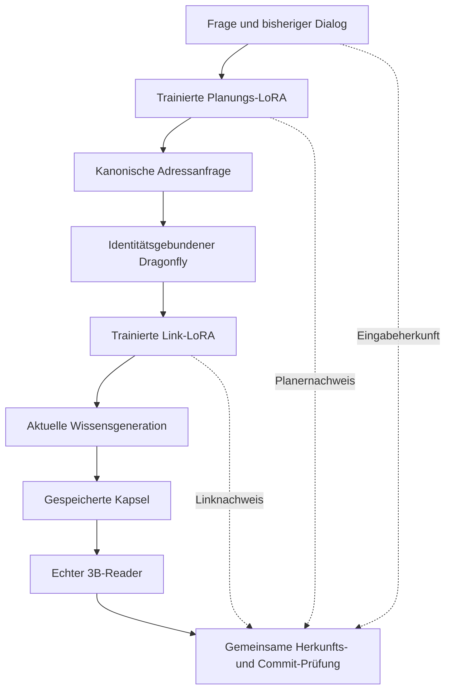

# Planer, Link-LoRA und Kapselantwort unter gemeinsamer Herkunft

Der erste vollständige gestufte Versuch ist `runs/dialogue-capsules-001`:

## Ausgeführt und technisch geprüft

- Die tatsächliche Planungs-LoRA erzeugt sieben passende Adressen und zweimal
  UNKNOWN. Die tatsächliche Link-LoRA erzeugt für alle sieben positiven Fälle
  den richtigen stabilen Verweis. Beide Adapter nutzen dasselbe 0.5B-Basismodell.
- Der 3B-Int8-Reader lädt die zugehörige aktuelle 27-Tage-Kapsel und beantwortet
  die ursprünglichen Fragen einschließlich Dialogreferenzen und Operationen.
  Die beiden UNKNOWN-Fälle benötigen keine Reader-Inferenz.
- Planer-Artefakt, Planerentscheidung, Originaleingabe, gelernte Adresse,
  Link-Artefakt, Linkentscheidung, Generation und Kapsel gehören zur gemeinsamen
  Herkunftskette der jeweiligen Antwort. Modellbasisgewichte bleiben unverändert.
- Unabhängiger Evidenzaudit bestätigt 112 Knotenhashes, sieben vollständige
  Ersttoken-Logitpaare und tatsächliche Token-Decodierung/EOS. Frischer Präfix
  und Kapsel liefern im Runner dieselben Tokenfolgen.
- Sechs Kontrollen auf Registerkopien bestehen: Planer-Training, einzelne
  Anfrage, Link und Fakt können abhängige Commits sperren; Anfragewiderruf bleibt
  selektiv; Planerwiderruf lässt unabhängige Link-/Kapselnutzlasten bestehen.

## Antwortqualität: noch nicht bestanden

Der Reader erhält im ersten Lauf den Dialog als JSON-Text. Mehrere Antworten
nennen zwar 27 oder 29 Tage, verändern aber X12 zu X11/X1. Die direkte Antwort
behauptet widersprüchlich, der Fakt fehle; die deutsche Folgefrage wird nicht
beantwortet. Solche Ausgaben sind trotz passender Zahlen falsch.

Nach inhaltlicher Sichtung erfüllt nur die Puffer-Folgefrage die geforderte
positive Antwort zuverlässig; die beiden UNKNOWN-Fälle sind korrekt. Diese
Sichtung ist von den technischen Auditorprüfungen getrennt. Ein erfolgreicher
Audit bedeutet hier konsistente Evidenz eines noch fehlerhaften Systems.

Die abgeschlossene Vergleichskopie `dialogue-capsules-plain-001` prüft denselben
Dialog als lesbaren Text. Unverändert bleiben Modell, Fragen, Kapseln, sieben
vorher tatsächlich erzeugte Linkentscheidungen und das 64-Token-Limit. Es ist
eine Entwicklungsgegenprobe auf bekannten Fällen, keine neue Validierung.

Die inhaltliche Sichtung ergibt dort **5/9 statt 3/9**: direkte Antwort,
Puffer-Folgefrage, referenzielle Folgefrage und beide UNKNOWN-Fälle sind
inhaltlich korrekt. Überflüssiges Yes/No in Dauerantworten bleibt ein
sprachlicher Mangel. Planung behauptet eine Ankunft zum Bestelldatum,
der 20-Tage-Vergleich enthält eine falsche Zahlenbegründung, die Pufferfrage
verändert X12 zu X1, und die deutsche Antwort bleibt widersprüchlich.

Die Bewertungen stehen mit Begründungen und Hash der zugrunde liegenden
Ergebnisdatei in `content-review.json` beider Läufe. Es sind Codex-Sichtungen,
keine unabhängigen menschlichen Bewertungen. Der technische Audit des zweiten
Laufs bestätigt 119 Knotenhashes, sieben Logitpaare und dieselben sechs
Widerrufskontrollen. Keine dieser Prüfungen erklärt die Antwortqualität für gut.

Nächste Ursachendiagnose: Numerik gegen Modell-/Promptfähigkeit prüfen. Die
Antworten stammen aus der lokalen Int8-Variante; aus ihren Fehlern folgt noch
nicht, dass unveränderte BF16-/Float32-Gewichte dieselben Fehler hätten. Frühere
vollpräzise 3B-Versuche wurden wegen Speicher-/Pagingdruck vorzeitig beendet,
ohne diese konkreten Fälle abschließend zu testen. Keine weitere kleine
Promptänderung soll diese offene Vergleichsfrage verdecken.

## Autoritätsgrenze

`adopt_lineage.py` übernimmt den verifizierten Planer-DAG atomar in das lokale
Versuchsregister. Gleiche Schlüssel bleiben gleich; widersprüchliche Heads,
manipulierte Inhalte, fehlende Berechtigung und widerrufene Knoten werden
abgewiesen. Ein erneuter Import kann keinen lokalen Widerruf zurücknehmen.

Ab der Kopie ist das Versuchsregister die lokale Autorität. Spätere Änderungen
des getrennten Trainingsregisters werden NICHT automatisch synchronisiert.
Das ist kein verteiltes Widerrufsprotokoll. Die neun Dialogverläufe stammen aus
explizit markierten synthetischen Eingabequellen; sie sind noch keine produktive
Dialoghistorie mit verknüpften früheren Assistant-Receipts.

Die zwei Modellstufen laufen aus Speichergründen nacheinander. Dieser Versuch
belegt keine gleichzeitig laufende Anwendung und keinen Produktions-Speedup.

## Hidden activation causal control

A fresh Qwen-3B Int8 replay answers all 6 supplier questions correctly when the
fact is present only in the activated prefix KV capsule (`prefix_kv_only`). The
same questions with no Pod KV state and no fact text in the input produce `0/6`
correct answers. This is a causal control for Pod-state dependence, not yet proof
of permanent weight internalization.

## Replay revocation control

On a copied replay register, revoking the generation's source revoked 19
transitive nodes and blocked a previously valid answer receipt. The original
replay remains unchanged. This confirms selective lifecycle invalidation reaches
reader answers.

## Replay generation control

On a copied replay register, publishing a new generation with value 19 makes the
old answer receipt stale and blocks it. The old receipt cannot survive a head
switch, even without revoking its origin.
## Value-bearing LoRA control

`runs/internal-fact-lora-001` trains a Qwen-3B LoRA Pod on 20 paraphrases of
the Müller/X12 fact. On six unseen aliases and German/English formulations,
the adapter answers without evidence text at `6/6`; the matched no-LoRA control
was `0/6`. This is direct evidence that a Pod can carry a concrete value in
adapter weights. It is a small single-fact memorization experiment, not broad
knowledge generalization.

## Multi-fact internal LoRA

A value-bearing Qwen-3B LoRA was trained on five independent supplier/component
facts using 25 paraphrased training questions. On 25 unseen formulations, with
no evidence text in the prompt, it recalled all five values correctly (`25/25`).
This demonstrates multi-fact adapter storage, while still requiring scale and
interference tests before broad claims.

## Multi-fact LoRA with abstention

The multi-fact adapter was retrained with explicit unknown-supplier examples.
On 25 known-fact formulations it scored 24/25 (96%); on three unknown cases it
returned UNKNOWN 3/3. Overall score was 27/28 (96.43%), with no evidence text in
any test prompt. The single known error is retained as an interference case for
future training and should not be hidden.

## Corrected multi-fact LoRA run

After adding supplier-only and German training forms under the same system
contract, the corrected adapter reaches 25/25 known values and 3/3 UNKNOWN
cases (`28/28`, 100%) without evidence text. The prior 003 collapse to UNKNOWN
is retained as a failed ablation.

## Multi-fact adapter reload

A fresh Qwen process loaded the saved multi-fact adapter and replayed all 28
no-evidence cases: `28/28` correct, including `25/25` known values and `3/3`
UNKNOWN cases. This confirms the result survives adapter serialization and
reload, not just the original training process.

## Generation-bound value LoRA

The value-bearing LoRA is registered as a `lora` artifact derived from the
current `GenerationKey` and its training origin. Revoking that training origin
on a copied registry blocks activation of the adapter (`revoked_activation_blocked=true`).
The original replay registry is untouched.

## Generation-bound reader activation (2026-09-16)

`ExecutionManifest.build(..., reader_key=...)` now requires the reader LoRA artifact to carry the exact requested `GenerationKey` in its registry lineage. Value-bearing adapters are registered with `activation_contract=generation_and_training_lineage`, so both the knowledge generation and the adapter training origin are lifecycle dependencies. A generation mismatch is rejected before model execution; revoking either lineage root invalidates the artifact. Verified by `tests/test_execution_manifest.py` and the bound artifact report `runs/value-pod-bound-002.json`.

