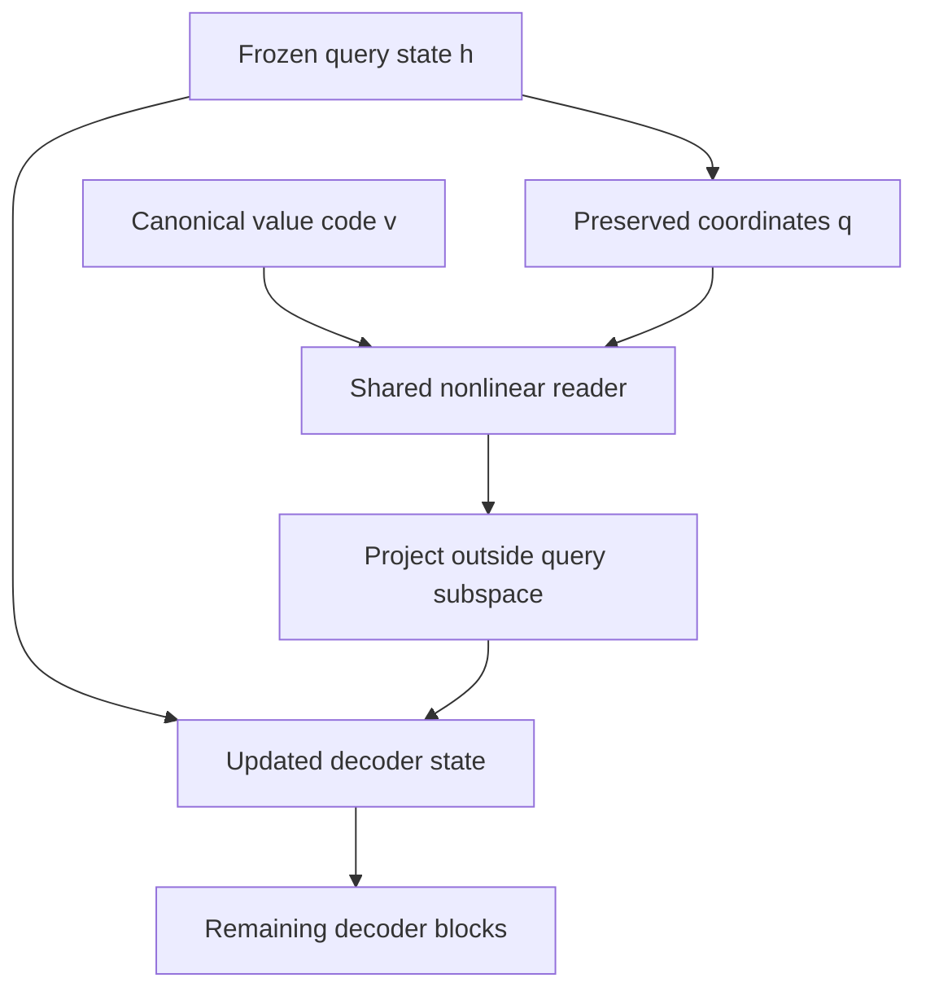

# QC-CR1: value-coded reversible decoder interface

This is an implemented research interface at one frozen Qwen decoder boundary.
It is not the complete Symlink–Pod architecture and not a demonstrated invention.
An exact identity lookup supplies a four-valued code; that lookup is an oracle in
this experiment. All learned weights are shared. The model receives no runtime
knowledge text on the native path.

## Two repairable parameterizations

The affine reader applies, in row-vector convention,

\[
T_v(h)=h+((h-c)Q)W_v+b_v,\quad Q^TQ=I.
\]

For the bounded variant, \(\|W_v\|_2\le0.9\). Hence the exact linear Jacobian has
singular values in[0.1,1.9] and condition number at most19. Bias does not change
this Jacobian but can worsen floating-point cancellation. An unconstrained affine
control uses the same parameter shapes and training schedule.

The nonlinear reader uses a fixed query coordinate and a projected correction:

\[
q=(h-c)Q,\quad P=I-QQ^T,\quad
\delta_v(q)=f_\theta(q/s,\operatorname{onehot}(v))P,\quad
T_v(h)=h+\delta_v(q).
\]

Here f is a64-hidden-unit GELU network. Since \(P Q=0\), the query coordinate is
preserved in exact arithmetic: \((T_v(h)-c)Q=q\). Thus direct replacement can use
the materialized state y alone:

\[
q_y=(y-c)Q,\qquad
R_{a\rightarrow b}(y)=y-\delta_a(q_y)+\delta_b(q_y).
\]

An absent code has zero correction. The query coordinates are learned PCA axes
of bare training prompts, not a semantic truth certificate. No global Jacobian
conditioning bound is asserted for the nonlinear coupling.

## Lifecycle boundary

The exact formulas apply while the state remains at this decoder boundary.
The experiment recomputes subsequent blocks. It does not transform old attention
KV caches, delete old generated tokens, validate commits, or invalidate previously
materialized descendants. Older runtime research cannot be claimed as integrated
merely because its requirements are compatible with this interface.

Repeated numerical replacements are measured against an independently fresh
boundary for each new code. Error is allowed to accumulate; no bitwise or unbounded
lifetime guarantee is inferred from256observed edits.

## Prior-art boundary

Efficiently invertible nonlinear coupling is an established ingredient in
[NICE](https://arxiv.org/abs/1410.8516). Constrained residual invertibility is
established by [Invertible Residual Networks](https://proceedings.mlr.press/v97/behrmann19a.html).
Editable episodic control of language models has direct prior work in
[Larimar](https://arxiv.org/abs/2403.11901). Their primary abstracts were checked;
these systems were not reproduced in this round.

The possible project contribution would have to be the demonstrated joint result:
generalizable runtime fact consumption, canonical lifecycle transitions that
cover all materialized descendants, and a quality/cost advantage against strong
comparators. The affine inverse, spectral cap, coupling network, low-rank basis,
or editable memory separately cannot carry that claim. A claim-level literature
and patent audit remains open.
